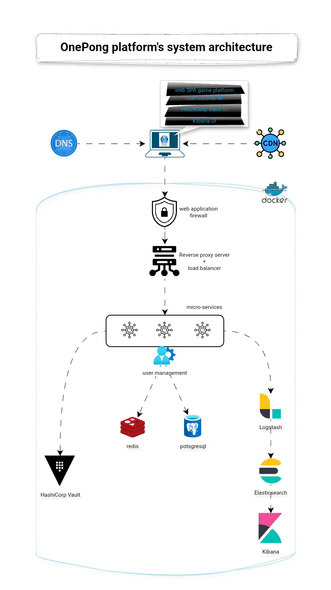

# OnePong - Transcendance

 ⚠️ ***This repository specially the Readme is being edited and so is not finished yet.*** ⚠️

## Overview

A web based Platform designed with an "One Piece" theme to provide an immersive and engaging gaming experience. It is centered around the classic Pong game, but with multiple enhancements such as multiplayer functionality, customization options, hardened configuration, and more. The platform also introduces a variety of robust user features (like history tracking and matchmaking), and several infrastructure and security improvements.

The project is designed to be scalable, accessible, and user-friendly, supporting a wide range of user preferences. It also incorporates a modern architecture using microservices and DevOps tools to ensure high performance and maintainability.

  

<!--  -->

Key Features
1. Multiplayer Modes

    • **Remote Players**: Play the classic Pong game with friends across different devices, maintaining an optimized user experience despite potential network issues (lag, disconnection, etc.).
    
	• **Multiple Players**: Supports games with more than two players. Customizable modes allow for dynamic gameplay (e.g., a 4-player game on a square board).

3. Customization Options

    • **Power-ups & Custom Maps**: Customize gameplay with power-ups, special abilities, and different game maps to enhance the gaming experience.
    
	• **Default Simpler Version**: For those who prefer a straightforward experience, players can select a basic version of any game.

4. Matchmaking & User History

    • **Game History**: Track and display your gameplay stats and progress, including win/loss records and performance metrics.
    
	• **Matchmaking System**: Find opponents for fair and balanced matches, ensuring everyone has a competitive gaming experience.

5. Live Chat
    
	• **Player Profiles**: Access player profiles and interact with others through the chat interface.

6. Robust Security

    • **ModSecurity Web Application Firewall (WAF)**: Secure the platform against web-based attacks and threats.

    • **HashiCorp Vault**: Securely manage and store sensitive information, such as API keys, credentials, and environment variables, ensuring that these secrets are properly encrypted and isolated.
    
	• **Two-Factor Authentication (2FA) and JWT**: Secure user accounts with an added layer of security through 2FA, and manage user authentication and sessions using JWT.

7. Infrastructure and DevOps

    • **ELK Stack for Logging**: Efficiently manage and analyze log data using Elasticsearch, Logstash, and Kibana (ELK).
    
	• **Microservices Architecture**: The backend is designed with microservices, enabling flexibility, scalability, and easy maintenance.

8. Advanced Graphics

    • **3D Visuals with Three.js**: Enhance the visual experience of the Pong game by introducing advanced 3D techniques, immersing players in the game environment.

9. Accessibility
    
	• **Browser and Language Support**: The platform is compatible with multiple browsers and offers multilingual support for a broader international audience.

10. Server-Side Pong

    • **Server-Side Logic**: Move the core gameplay mechanics (like ball movement and player actions) to the server, ensuring smoother experiences, faster responses, and better scalability.

## Skills and Technologies

This project requires a broad range of skills across various domains. The key technologies and tools involved in its development include:

### Frontend Development

    HTML/CSS/JavaScript: Building the core web interface user-friendly gameplay.

    Three.js: Implementing advanced 3D graphics to enhance the visuals of the Pong game.

### Backend Development

    Django: Implementing server-side logic for gaming, multiplayer support, game state management and user management.

    RESTful APIs: Designing APIs to allow interaction with the Pong game and additional games.

    WebSocket: For real-time multiplayer interactions, enabling seamless communication between remote players.

### Database and Data Storage

    Postgresql: Storing user profiles, game history, and matchmaking data securely.

    Redis: For fast, in-memory data storage, especially for information exchange state synchronization.

### DevOps and Infrastructure

    Architecture: Containerizing microservices for easy deployment and scalability.

    ELK Stack: Using Elasticsearch, Logstash, and Kibana for logging and real-time data analysis.

### Security

    HashiCorp Vault: Secure storage of sensitive information (e.g., API keys, database credentials).

    OAuth, JWT: For managing user authentication and authorization.

    Two-Factor Authentication (2FA): Enhancing security by requiring multiple verification methods.

### Accessibility and SEO

    Server-Side Rendering (SSR): Using SSR for faster page load times, improved SEO, and better performance.
  
