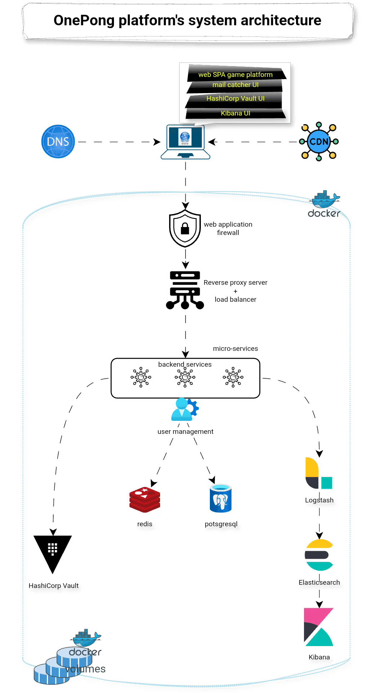
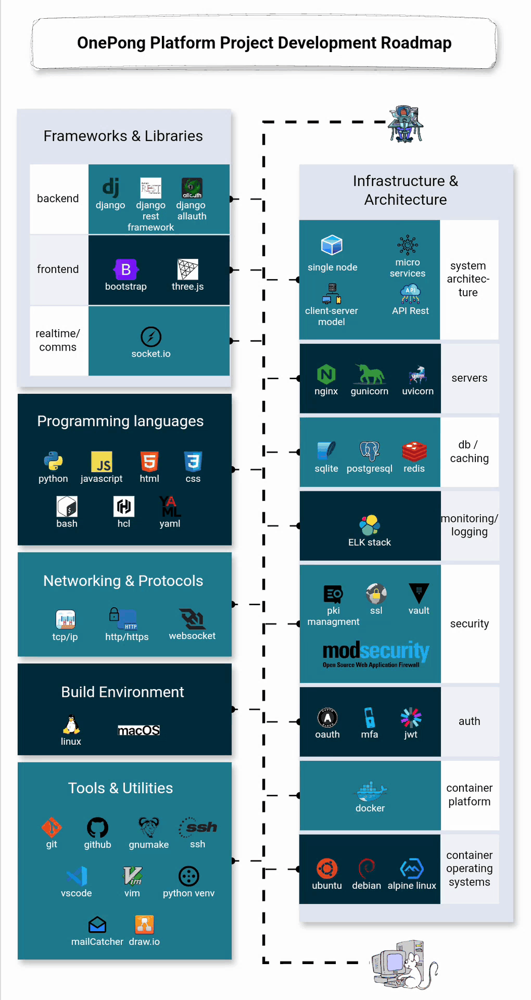
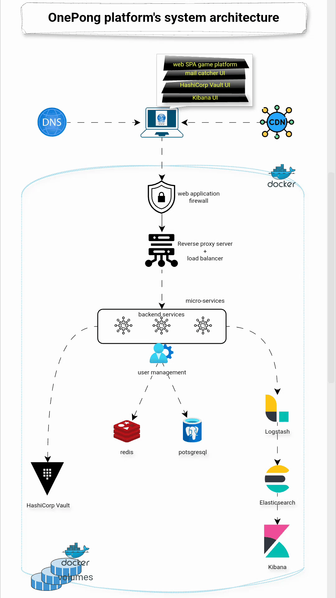

# OnePong - Transcendance

 ⚠️ ***This repository specially the Readme is being edited and so is not finished yet.*** ⚠️

## Overview

A web based Platform designed with an "One Piece" theme to provide an immersive and engaging gaming experience. It is centered around the classic Pong game, but with multiple enhancements such as multiplayer functionality, customization options, hardened configuration, and more. The platform also introduces a variety of robust user features (like history tracking and matchmaking), and several infrastructure and security improvements.

The project is designed to be scalable, accessible, and user-friendly, supporting a wide range of user preferences. It also incorporates a modern architecture using microservices and DevOps tools to ensure high performance and maintainability.

---

	

		
	

	

		
	

<!-- 

 -->
<!--  -->

---

## 🚀 Key Features

### 🎮 1. Multiplayer Game Modes

- **Remote Multiplayer**  
  Play classic Pong with friends across different devices, regardless of location. Our network-optimized system is designed to handle real-world challenges like latency, packet loss, and intermittent disconnections while maintaining a smooth gameplay experience.

- **Beyond 1v1: Multiplayer Expansion**  
  Experience new ways to enjoy Pong with support for more than two players. Choose from creative, non-traditional layouts—like a 4-player battle on a square or circular board—for dynamic and chaotic matches that keep the gameplay fresh.

---

### ⚙️ 2. Customization & Gameplay Options

- **Power-ups and Special Maps**  
  Inject fun and strategy into each game with power-ups like speed boosts, ball splitters, shields, and more. Choose from various maps with unique layouts and obstacles for a tailored game experience.

- **Minimalist Mode**  
  Prefer the good old Pong? Opt for the default, simplified version for pure, distraction-free gameplay without bells and whistles.

---

### 🔍 3. Matchmaking & Player History

- **Smart Matchmaking**  
  Automatically pair players based on skill level and performance, ensuring balanced and engaging matches for everyone.

- **Player Progress & Stats**  
  Track wins, losses, high scores, longest rallies, and more. Build your profile and watch your skills grow over time with detailed analytics and historical records.

---

### 🔐 4. Security & Data Protection

- **Enterprise-Grade Protection**  
  Using **ModSecurity (WAF)**, the platform is safeguarded from common web-based threats, including SQL injection, XSS, and DDoS attacks.

- **Secure Secrets Management**  
  All sensitive data (API keys, DB credentials, environment variables) are securely managed using **HashiCorp Vault**, with strong encryption and access policies.

- **Modern Authentication Stack**  
  Users are protected through **JWT-based session management**, and **2FA** adds an extra layer of login security.

---

### 🛠️ 5. DevOps & Infrastructure

- **Microservices-Based Architecture**  
  The backend is composed of independently deployable services, making the platform highly modular, scalable, and easier to maintain.

- **Comprehensive Logging with ELK Stack**  
  Real-time log aggregation, monitoring, and visualization using **Elasticsearch**, **Logstash**, and **Kibana**.

- **Containerized Deployment**  
  Microservices are containerized for efficient deployment, scaling, and orchestration across environments.

---

### 🎨 6. Advanced Visuals & Graphics

- **3D Experience with Three.js**  
  The classic game receives a modern facelift with 3D visuals, lighting effects, animations, and immersive environments powered by **Three.js**.

---

### 🌐 7. Accessibility & Cross-Platform Support

- **Browser Compatibility & Language Support**  
  Play on all modern browsers with a responsive UI and multilingual support to cater to global audiences.

- **Server-Side Rendering (SSR)**  
  Improve SEO, load times, and accessibility with pre-rendered content delivered server-side.

---

### 🧠 8. Server-Side Game Logic

- **Smooth, Centralized Game Control**  
  Core gameplay logic, including ball movement, physics, collision detection, and scoring, runs on the server for consistent, cheat-resistant multiplayer interactions.

---

## 🧰 Skills & Technologies Used

This project spans full-stack development, game design, DevOps, and security. Here's a breakdown of the tools and technologies:

### 🌐 Frontend Development

- **HTML/CSS/JavaScript** – Building the responsive UI and game canvas.
- **Three.js** – Rendering dynamic 3D graphics and animations in the browser.

### 🧩 Backend Development

- **Django** – Server-side logic for gameplay, user authentication, and API endpoints.
- **RESTful APIs** – Structured API design for extensibility and third-party integrations.
- **WebSocket** – Real-time communication for synchronous multiplayer gameplay.

### 🗄️ Data Storage & Caching

- **PostgreSQL** – Persistent storage for users, match history, and performance data.
- **Redis** – In-memory data store for quick access and game state synchronization.

### ⚙️ DevOps & Infrastructure

- **Microservices** – Decoupled services for modularity and performance.
- **ELK Stack (Elastic, Logstash, Kibana)** – Real-time monitoring, analytics, and diagnostics.
- **Containerization** – Docker for deployment, environment consistency, and scalability.

### 🔐 Security Stack

- **HashiCorp Vault** – Encryption and secure management of secrets.
- **JWT & OAuth** – Token-based authentication for secure, scalable user sessions.
- **Two-Factor Authentication (2FA)** – Optional, but recommended, user identity verification.

### ♿ Accessibility & SEO

- **Server-Side Rendering (SSR)** – Fast page loads and better SEO performance, especially for multilingual support.

